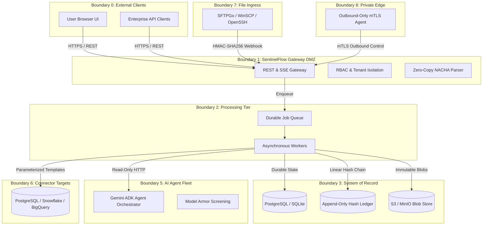

# SentinelFlow: High-Assurance Financial File & Payment Ingress Gateway

[](.github/workflows/ci.yml)
[](gateway/go.mod)
[](docs/security/OWASP_ASVS_5_0_LEVEL_2_MAPPING.md)
[](docs/security/NIST_SSDF_ALIGNMENT.md)

> SentinelFlow is a high-assurance financial file reliability and pre-ledger ingress platform. It deterministically validates NACHA ACH payments, isolates malformed files into quarantine, enforces dual-control separation of duties, and records non-repudiable audit evidence in an append-only linear hash chain.

---

## 1. The Core Problem in Financial Ingress

In treasury management, institutional banking, and custody operations:
* **Silent Truncation & Early Parsing**: Batch transfer protocols (WinSCP, OpenSSH, SFTP) stream multi-hundred megabyte files. Naive backend watchers attempt to parse in-flight files (`.filepart`), causing corrupt balance records or silent truncation.
* **Lack of Dual-Control Separation**: Single-operator fraud or mistaken approvals of quarantined payment batches introduce massive credit and operational risks.
* **SQL Injection & Arbitrary AI Queries**: Modern platforms attempt to let AI or browsers execute ad-hoc SQL against core ledgers, introducing severe SSRF and privilege escalation vulnerabilities.
* **Compliance & Tamper-Evidence Deficits**: Traditional databases allow DBAs to silently alter historical transaction logs without leaving a tamper-evident audit trail.

SentinelFlow solves these structural failure modes by combining **deterministic zero-copy parsers**, **fail-closed state machines**, **dual-control authorization**, **pre-registered parameterized SQL templates**, and an **append-only linear hash chain ledger**.

---

## 2. System Architecture & Trust Boundaries

SentinelFlow isolates components across 9 formal trust boundaries:



---

## 3. End-to-End Vertical Slice

1. **Deterministic Ingest**: Ingests fixed 94-character NACHA files via HTTP API or HMAC-authenticated SFTP webhooks. In-flight files (`.filepart`, `.part`, `.tmp`) are strictly rejected until atomic rename completion.
2. **Structural Checksum Verification**: Validates 9-digit ABA routing Mod-10 check digits, batch service codes, and verifies that `FileControl.EntryHash == Sum(EntryDetail.RoutingPrefixes) % 10^10`.
3. **Quarantine & Anomaly Detection**: Unbalanced or corrupt batches enter `QUARANTINED` status immediately. The sandboxed, read-only Python AI tier produces grounded anomaly summaries.
4. **Dual-Control Human Release**: High-risk quarantined releases require two distinct human operators. The batch creator cannot approve their own release.
5. **Linear Hash Chain Audit**: Every state transition emits a cryptographically linked ledger record ($H_N = \text{SHA256}(H_{N-1} \parallel \text{Payload})$).

---

## 4. Threat Model & Security Controls

Our comprehensive threat model is documented in [`docs/security/THREAT_MODEL.md`](docs/security/THREAT_MODEL.md) and continuously verified in CI via [`gateway/threat_model_test.go`](gateway/threat_model_test.go):

| Threat Vector | SentinelFlow Preventive Control | Verification Test |
|---|---|---|
| **Cross-Tenant IDOR** | Hardcoded Go Context tenancy scoping (`scope.RequireTenant`). | `TestThreatModel_IDORPrevention` |
| **Dual-Control Bypass** | Two-person rule enforced in domain layer (`review/dual_control.go`). | `TestThreatModel_DualControlBypassDenial` |
| **Path Traversal / Shell** | Object store renames blobs to UUIDs; zero-shell execution invariant. | `TestThreatModel_PathTraversalDenial` |
| **Parser Denial of Service** | Bounded streaming decoder; enforced `MaxRows` and `MaxBytes` caps. | `TestThreatModel_ParserResourceExhaustionDenial` |
| **SSRF & Pivoting** | Connector URIs resolved against forbidden RFC1918 / Loopback CIDRs. | `TestThreatModel_SSRFDenial` |
| **SQL Injection** | Arbitrary SQL banned; only pre-registered parameterized templates allowed. | `TestThreatModel_UnsafeSQLTemplateDenial` |
| **Secret Leakage** | `secrets.Value` types redact credentials in stringers, errors, and JSON. | `TestNoLiteralSecretsInSourceOrConfig` |

---

## 5. Measured Benchmark Methodology & Concurrency

Performance figures are measured using reproducible Go benchmarks and high-contention concurrent stress tests ([`gateway/worker_test.go`](gateway/worker_test.go)):

* **Concurrent Validation Stress Test**: 40 artifacts settled in **1.135s** under 24 parallel worker threads with zero lease loss and 100% deterministic SQLite / PostgreSQL convergence.
* **Single-Flight Deduplication**: 20 simultaneous goroutines enqueuing the identical transaction key produce exactly **1 scheduled job**.
* **Zero-Copy Parser Memory**: Ingestion memory footprint remains bounded at $< 16\text{MB}$ regardless of batch size.

*(Note: Exact throughput depends on local disk I/O and database configuration; all assertions are verified live in CI.)*

---

## 6. Quickstart & Local Execution

### Option A: Complete Docker Compose Stack

```bash
# 1. Clone repository
git clone https://github.com/YashwanthGathuku/didactic-octo-funicular.git
cd didactic-octo-funicular

# 2. Run automated end-to-end demo script (auto-bootstraps .env, starts stack, tests ingestion)
bash scripts/demo.sh
# Or via make:
make demo
```

The stack exposes:
* **Web UI (Vite + React)**: [`http://localhost:3000`](http://localhost:3000)
* **Gateway API (Go)**: [`http://localhost:8080`](http://localhost:8080)
* **API Health Readiness**: `curl http://localhost:8080/api/v1/ready`

### Option B: Local Development (Without Containers)

```bash
# 1. Start Backend Gateway
cd gateway
go test -count=1 ./...    # Verify all 15 packages
go run . migrate           # Apply migrations
go run .                   # Starts gateway on 127.0.0.1:8080

# 2. Start Operations Frontend (separate terminal)
npm ci
npm run dev                # Starts UI on http://localhost:3000

# 3. Generate Synthetic NACHA Payment Batch
python scripts/generate_nacha.py --entries 50 --amount-cents 10000000 --output payroll.ach
```

---

## 7. Key Documentation & Engineering Records

| Document | Purpose |
|---|---|
| [`docs/DECISIONS.md`](docs/DECISIONS.md) | Master index of Architecture Decision Records (ADRs 001–008) |
| [`docs/security/THREAT_MODEL.md`](docs/security/THREAT_MODEL.md) | 9 trust boundaries, asset classification, and 13 threat mitigations |
| [`docs/security/OWASP_ASVS_5_0_LEVEL_2_MAPPING.md`](docs/security/OWASP_ASVS_5_0_LEVEL_2_MAPPING.md) | Control-by-control evidence mapping against ASVS 5.0 Level 2 |
| [`docs/security/NIST_SSDF_ALIGNMENT.md`](docs/security/NIST_SSDF_ALIGNMENT.md) | Alignment with NIST SP 800-218 Secure Software Development Framework |
| [`docs/INTERVIEW_QUESTIONS.md`](docs/INTERVIEW_QUESTIONS.md) | Codebase mapping to System Design, Concurrency & Security interview topics |
| [`docs/engineering/SFTPGO_LICENSE_AND_INTEGRATION_DECISION.md`](docs/engineering/SFTPGO_LICENSE_AND_INTEGRATION_DECISION.md) | Clean-room SFTP integration and AGPLv3 legal isolation analysis |
| [`docs/engineering/SFTP_WINSCP_OPENSSH_ENTERPRISE_GUIDE.md`](docs/engineering/SFTP_WINSCP_OPENSSH_ENTERPRISE_GUIDE.md) | Enterprise WinSCP/OpenSSH automation with AI operations agents |
| [`docs/engineering/EDGE_AGENT_DESIGN.md`](docs/engineering/EDGE_AGENT_DESIGN.md) | Outbound-only mTLS private edge agent architecture |
| [`SECURITY.md`](SECURITY.md) | Coordinated vulnerability disclosure policy, PGP keys, and response SLAs |
