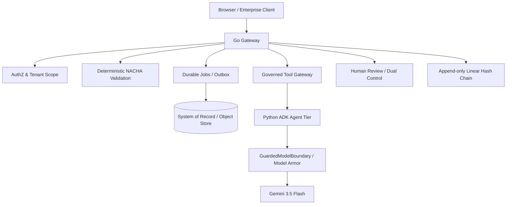

# SentinelFlow: Governed Financial File Reliability & Agent Control Plane

[](.github/workflows/ci.yml)
[](gateway/go.mod)
[](docs/security/OWASP_ASVS_5_0_LEVEL_2_MAPPING.md)

> SentinelFlow deterministically validates financial-file ingress, isolates invalid artifacts, governs AI investigation through explicit trust boundaries, enforces human release controls, and records tamper-evident audit history. AI output is advisory and cannot itself release financial artifacts.

## Core Authority Model

```text
AI advice != financial authority
Memory recall != evidence
Return-risk score != compliance decision
High risk != automatic rejection
Low risk != automatic release
```

The Go control plane owns deterministic validation, policy, evidence, state transitions, return-risk scoring, candidate generation/verification gates, and release preconditions. The Python agent tier performs bounded explanation, investigation, and proposal work through fixed manifests and guarded model boundaries.

## P12.5 — Governed ACH Return Intelligence Truth Gate

P12.5 is a surgical correction of the P12 return-intelligence path. It adds no new subsystem and does not start P13.

### Guarded Gemini path

`ReturnRiskAgent` no longer calls the Gemini provider directly. Live inference follows:

```text
ReturnRiskAgent
  -> GuardedModelBoundary
  -> data minimization
  -> trust partitioning
  -> Model Armor input screening when configured
  -> Gemini 3.5 Flash
  -> Model Armor output screening when configured
  -> Pydantic schema validation
  -> evidence grounding
  -> deterministic score/tier dominance
```

Execution truth is explicit:

- `LOCAL` / `DETERMINISTIC` -> rule-grounded output is permitted and labeled deterministic.
- `LIVE` -> guardrail/provider failure is surfaced as typed failure; no silent deterministic success.
- `AUTO` -> follows the shared `GuardedModelBoundary` fallback semantics.

The submission-facing capability matrix distinguishes a **TESTED Gemini 3.5 governed provider path** from **IMPLEMENTED live Gemini 3.5 external execution**. Live external execution is not claimed as tested without separately observed evidence.

### Return-rate monitoring values and taxonomy

The shared semantics fixture and Go engine represent public Nacha monitoring values as:

- unauthorized: **0.5%**
- administrative: **3.0%**
- overall: **15.0%**

R10 uses current public semantics for an Originator that is not known and/or not authorized by the Receiver. R11 is represented for an entry not in accordance with the terms of an existing authorization and participates in unauthorized-return-rate handling. R16's regulatory-restricted category has **no invented percentage threshold** (`threshold_applicable=false`).

The MVP taxonomy is representative, not complete; R51 is deliberately outside the current MVP catalog.

### Deterministic risk score

The authoritative score still uses exactly seven weighted features:

```text
0.30 CodeSeverity
0.15 Frequency7d
0.10 Frequency30d
0.15 PartnerReturnRate
0.10 RecentTrend
0.10 Exposure
0.10 SLA
```

`SameCodeRecurrence`, `VerifiedPriorOccurrences`, and `SourceStrength` remain contextual/diagnostic features and are not added to the score merely for feature-count symmetry.

### Assessment hash

Return-risk assessment hashes reuse SentinelFlow's existing RFC 8785 canonical JSON implementation:

```text
SHA256(CanonicalJSON(protected deterministic assessment fields))
```

Volatile `AssessmentID` and `ComputedAt` are excluded from the protected digest so identical deterministic calculations produce identical assessment hashes while individual assessment records retain unique identities.

## System Boundaries



## Local Verification

```bash
# P12.5 deterministic return intelligence
cd gateway
go test ./internal/returnrisk/... -v
go test ./internal/...
cd ..

# AI unit/conformance + adversarial gates
pytest ai-tier/tests/ -v
python ai-tier/evals/return_runner.py
python ai-tier/evals/runner.py

# Submission drift
python scripts/generate_docs.py --check
```

CI additionally runs Go race tests, frontend tests/builds, migrations, secret hygiene, vulnerability scanning, and documentation checks. See [`.github/workflows/ci.yml`](.github/workflows/ci.yml).

## Quickstart

```bash
git clone https://github.com/YashwanthGathuku/didactic-octo-funicular.git
cd didactic-octo-funicular
bash scripts/demo.sh
```

Or use the repository's local development commands for the Go gateway and React UI.

## Key Engineering Records

| Document | Purpose |
|---|---|
| [`docs/engineering/CURRENT_STATE.md`](docs/engineering/CURRENT_STATE.md) | Current P12.5 capability and truth baseline |
| [`docs/architecture/ACH_RETURN_INTELLIGENCE.md`](docs/architecture/ACH_RETURN_INTELLIGENCE.md) | Governed return-intelligence architecture and semantics |
| [`docs/CAPABILITY_MATRIX.yaml`](docs/CAPABILITY_MATRIX.yaml) | Submission-facing implementation/test status source |
| [`docs/DEVPOST_SUBMISSION.md`](docs/DEVPOST_SUBMISSION.md) | Generated hackathon submission truth subset |
| [`docs/security/THREAT_MODEL.md`](docs/security/THREAT_MODEL.md) | Security boundaries and residual risks |
| [`docs/security/OWASP_ASVS_5_0_LEVEL_2_MAPPING.md`](docs/security/OWASP_ASVS_5_0_LEVEL_2_MAPPING.md) | Security control evidence mapping |
| [`SECURITY.md`](SECURITY.md) | Coordinated vulnerability disclosure policy |

## Scope Disclaimer

SentinelFlow is an engineering demonstration / staging candidate, not a certification of legal compliance or live payment-clearing suitability. Taxonomy guidance and AI recommendations are operational intelligence; institution-specific legal, compliance, and payment-release decisions remain outside model authority.
