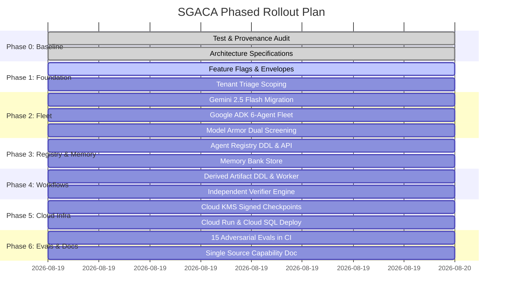

# SentinelFlow Governed Agentic Architecture — Phased Implementation Plan

## Overview & Implementation Strategy

This implementation plan outlines the additive, non-destructive rollout of the **SentinelFlow Governed Agentic Architecture (SGACA)** for Google's All Things Agentic Hackathon.

### Safety Guarantee: Feature Flags & Zero-Regression Invariant
All agentic capabilities are strictly additive. The system defaults to:
```bash
SENTINEL_AGENT_FLEET_ENABLED=false
SENTINEL_AGENT_FLEET_MODE=SHADOW
```
When disabled, the deterministic financial validation core operates identically to the baseline system.

---

## Phased Implementation Roadmap



---

## Phase Details & Verification Gates

### Phase 0: Baseline Audit & Invariant Locking (Complete)
- **Objectives**: Complete audit of existing architecture, package map, direct SQL in handlers, test baselines, and Git-history provenance.
- **Deliverables**:
  - `docs/architecture/SGACA.md`
  - `docs/architecture/IMPLEMENTATION_PLAN.md`
  - `docs/hackathon/HACKATHON_PROVENANCE.md`
  - `docs/hackathon/CAPABILITY_MATRIX.md`
- **Gate**: Complete test suite executed and recorded with 0 regressions.

### Phase 1: Additive Scoping, Feature Flagging & Evidence Envelopes
- **Objectives**:
  - Add `SENTINEL_AGENT_FLEET_ENABLED` and `SENTINEL_AGENT_FLEET_MODE` to `gateway/config.go`.
  - Fix tenant-scoping in `POST /api/v1/incidents/{id}/triage` in `gateway/main.go`.
  - Establish typed `EvidenceEnvelope` in `ai-tier/models/evidence.py` ensuring `raw_data_present = false`.
- **Verification**: `gateway/triage_test.go` (100% pass on cross-tenant 404 denial).

### Phase 2: Google ADK Specialist Agent Fleet & Model Armor
- **Objectives**:
  - Migrate AI tier from OpenAI to Google Gemini 2.5 Flash via `google-genai` SDK.
  - Implement the 6 Google ADK specialist agents in `ai-tier/agents/`:
    - `SentinelCoordinator` (Root)
    - `TriageAgent` (Severity P1-P4)
    - `ComplianceAgent` (NACHA / Reg E rules)
    - `RemediationAgent` (Derived artifact fix specs)
    - `VerifierAgent` (Independent re-check)
    - `MemoryAgent` (Cross-session pattern recall)
    - `EscalationAgent` (SLA breach risk prediction)
  - Implement least-privilege tool capability registry in `ai-tier/agents/tools.py`.
  - Implement Google Cloud Model Armor dual-screening in `ai-tier/armor/client.py`.
- **Verification**: `ai-tier/evals/runner.py` (Adversarial attacks blocked).

### Phase 3: Agent Registry & Memory Bank Storage
- **Objectives**:
  - Apply migration `012_agent_registry.sql` (`agent_registry`, `agent_invocations`).
  - Apply migration `013_agent_memory.sql` (`agent_memory`).
  - Implement Agent Registry API in `gateway/agents.go` (`GET /api/v1/agents`, `GET /api/v1/agents/{id}/invocations`, `POST /api/v1/agents`).
  - Implement tenant-isolated Memory Bank in `ai-tier/memory/store.py`.
- **Verification**: `gateway/agents_test.go` (Registration, listing, invocation logging).

### Phase 4: Derived Artifact Remediation & Independent Verification
- **Objectives**:
  - Apply migration `014_derived_artifacts.sql` adding `derived_from`, `derivation_reason`, `derivation_agent_id` to `file_instances`.
  - Implement derived artifact creation workflow in `gateway/worker.go`.
  - Implement independent deterministic verification in `gateway/verify.go` matching findings digests.
- **Verification**: `gateway/verify_test.go` (Untampered pass, hash mismatch denial).

### Phase 5: Google Cloud Infrastructure & KMS Signed Checkpoints
- **Objectives**:
  - Apply migration `015_kms_checkpoints.sql` for periodic ledger checkpoints.
  - Implement Cloud KMS asymmetric ECDSA P-256 checkpoint signer.
  - Create deployment manifests `deploy/cloudrun.yaml`, `deploy/cloudrun-ai.yaml`, and `deploy/setup-gcp.sh`.
- **Verification**: Secret hygiene scan and migration test execution.

### Phase 6: Evals, CI Hardening & Single-Source Matrix
- **Objectives**:
  - Expand adversarial evaluation suite to 15 scenarios in `ai-tier/evals/adversarial_dataset.json`.
  - Create single-source `docs/CAPABILITY_MATRIX.yaml` and generation script `scripts/generate_docs.py`.
  - Add `docs-drift-check` job to `.github/workflows/ci.yml`.
- **Verification**: `python scripts/generate_docs.py --check` passes in CI.
