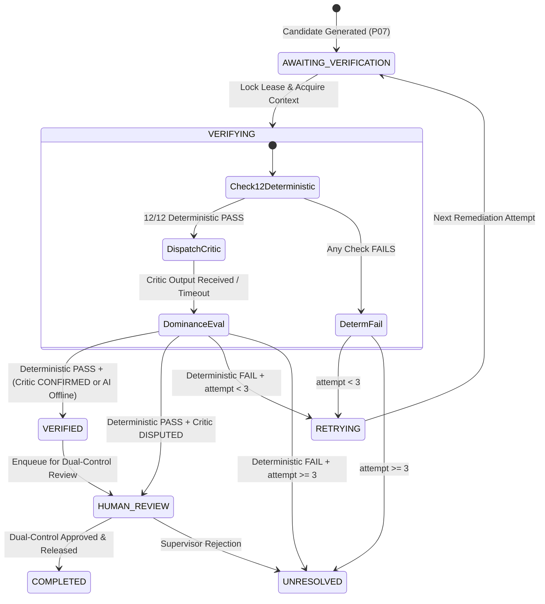

# SentinelFlow Phase P08 — Independent Verification & Critic Architecture

**Status**: TESTED / SPECIFICATION  
**Authoritative Architectural Specification**: SGACA (Sentinel Governed Agentic Control Architecture)  
**Classification**: Zero-Trust Pre-Ledger Financial Integrity & Dual-Control Control Plane  
**Target Track**: Fortified Enterprise Fleet  

---

## 1. Executive Summary & Core Mission

In financial pre-ledger ingress platforms processing batch ACH (NACHA), Fedwire, and ISO 20022 messages, autonomous remediation proposals must never be accepted on single-point trust. A remediation agent that generates a candidate repair cannot be permitted to certify its own work, nor can large language model reasoning be granted the authority to declare financial data valid.

**SentinelFlow Phase P08 (Independent Verification & Critic Architecture)** implements a rigorous **Maker-Checker Control Plane** grounded in the principle of **Deterministic Dominance**. 

```
                                  +---------------------------------------------+
                                  |         Quarantined Parent Artifact         |
                                  |            (Immutable in Storage)           |
                                  +----------------------+----------------------+
                                                         |
                                                         | P07 Governed Remediation
                                                         v
                                  +---------------------------------------------+
                                  |        Derived Candidate Artifact           |
                                  |          (AWAITING_VERIFICATION)            |
                                  +----------------------+----------------------+
                                                         |
                                                         | Trigger P08 Verification
                                                         v
+---------------------------------------------------------------------------------------------------------------+
|                                      Go Control Plane Verification Service                                    |
|                                                                                                               |
|  1. Re-read Candidate & Parent raw bytes from ObjectStore by SHA-256 digest                                   |
|  2. Execute 12 Typed Deterministic Integrity Checks:                                                          |
|     • Parent Immutability & Quarantine State       • Candidate Non-Empty & 94-Byte NACHA Alignment            |
|     • Candidate SHA-256 Addressability & Bytes      • Derivation Ledger Record & Derivation Hash Match         |
|     • Dual-Run NACHA Zero-Copy Validation Pass      • Validator Output Consistency (Run 1 == Run 2)           |
|     • Active Policy Bundle Freshness (TOCTOU)       • Resource Row Version Freshness (TOCTOU)                 |
|     • Allowlisted Remediation Operations Check                                                                 |
+-------------------------------------------------------+-------------------------------------------------------+
                                                        |
                            +---------------------------+---------------------------+
                            |                                                       |
                            v (Read-Only Context)                                   v (Deterministic Result)
+-------------------------------------------------------+   +---------------------------------------------------+
|               Python AI Tier (ADK)                    |   |           Deterministic Dominance Gate            |
|         VerifierAgent (Advisory Critic)               |   |                                                   |
|   • Autonomy Level A1 (Read-Only / No Mutation)       |   |   Deterministic FAIL  --> Immediate REJECT/RETRY  |
|   • Prompt Trust Partitioning & Input Minimization    |   |   Deterministic PASS  --> Evaluate Critic Opinion |
|   • Independent Review of Findings & Derivations      |   |   Critic DISPUTES     --> Escalate to HUMAN_REVIEW|
|   • Structured CriticOutput:                          |   |   Critic CONFIRMS     --> Transition to VERIFIED  |
|     (CONFIRMED | DISPUTED | PARTIAL)                  |   |   AI Tier Offline     --> Deterministic Pass Dominates|
+---------------------------+---------------------------+   +-----------------------+---------------------------+
                            |                                                       |
                            +---------------------------+---------------------------+
                                                        |
                                                        v
                                  +---------------------------------------------+
                                  |            Dual-Control Boundary            |
                                  |    (Verified != HumanApproved != Released)  |
                                  +---------------------+-----------------------+
                                                        |
                                                        | N-of-M Human Approval (N >= 2)
                                                        v
                                  +---------------------------------------------+
                                  |       Authoritative Egress / Release        |
                                  |         (Linear Hash Chain Audited)         |
                                  +---------------------------------------------+
```

---

## 2. Fundamental Mathematical Invariants & Authority Equations

### 2.1 The Verification Authority Equation
$$\mathbf{CriticOpinion \neq VerificationAuthority \implies VerificationAuthority = GoControlPlane}$$

- The Python AI Tier (`VerifierAgent`) operates strictly at **Autonomy Level A1 (Read-Only Advisory Critic)**.
- Model opinions, natural language commentary, and LLM-generated summaries carry **zero authoritative permission**.
- Verification authority is exclusively vested in the compiled Go Control Plane, which evaluates cryptographic digests, fixed-width structural alignment, arithmetic accumulators, and deterministic policy constraints.

### 2.2 The Deterministic Dominance Invariant
$$\mathbf{DeterministicVerification \succ CriticOpinion}$$

For any candidate artifact $C$ evaluated by deterministic check suite $D(C) \in \{\text{PASS}, \text{FAIL}\}$ and advisory critic $A(C) \in \{\text{CONFIRMED}, \text{DISPUTED}, \text{PARTIAL}\}$:
1. If $D(C) = \text{FAIL}$, the candidate is **unconditionally rejected or retried**, regardless of whether the critic generated $\text{CONFIRMED}$. A model hallucination can **never** waive a failed Mod-10 checksum, batch accumulator imbalance, or hash mismatch.
2. If $D(C) = \text{PASS} \land A(C) = \text{DISPUTED}$, the workflow transitions to `HUMAN_REVIEW` with full critic dispute reasoning attached. The critic acts as a safety tripwire, but cannot unilaterally alter deterministic truth.
3. If $D(C) = \text{PASS} \land \text{Unavailable}(A)$, the deterministic pass dominates, and the workflow transitions safely to `VERIFIED` (or `HUMAN_REVIEW` per tenant policy), preventing AI tier outages from causing system-wide denial of service.

### 2.3 The Dual-Control Boundary Invariant
$$\mathbf{Verified \neq HumanApproved \neq Released}$$

$$\text{CanRelease}(C) \iff \text{State}(C) = \text{VERIFIED} \land \text{Approvals}(C) \ge 2 \land \text{DistinctReviewers} \land \text{PolicyPermitted}(t_{\text{release}}) \land \text{UnchangedDigest}(C)$$

- `VERIFIED`: The candidate artifact has mathematically passed all 12 deterministic verification checks and has been confirmed or reconciled by the Go Control Plane.
- `HumanApproved`: Two or more distinct authorized human supervisors ($A_1 \neq A_2 \land A_i \neq \text{Proposer}$) have explicitly attested to the release in the operations console.
- `Released`: The candidate artifact is scheduled for cryptographic signing, ledger entry, and bank egress transmission. No autonomous agent or control plane routine can bypass human authorization to release funds.

### 2.4 The Fresh Byte Re-Read Invariant
$$\mathbf{\text{VerifyBytes}(C) = \text{ObjectStore.Read}(\text{CandidateSHA256})}$$

Verification never operates on in-memory buffers or uncommitted pipeline state. The Go Verification Service re-reads raw byte streams directly from the immutable ObjectStore by SHA-256 address, guaranteeing that what is verified is byte-for-byte identical to what is persisted.

---

## 3. Verification State Machine & Complete Lifecycle

The verification lifecycle is integrated into the Go Control Plane's 16-state workflow engine (`AgentWorkflowState`).



### Complete State Transition Matrix

| Current State | Event / Guard | Target State | Action / Ledger Event |
| :--- | :--- | :--- | :--- |
| `AWAITING_VERIFICATION` | `START_VERIFICATION` | `VERIFYING` | Atomically increments `row_version`, acquires singleflight execution lock, records `VERIFICATION_STARTED`. |
| `VERIFYING` | 12/12 Checks PASS + Critic `CONFIRMED` | `VERIFIED` | Emits `VERIFICATION_PASSED`, sets outcome `VERIFICATION_SUCCESSFUL`, enqueues candidate into dual-control review queue. |
| `VERIFYING` | 12/12 Checks PASS + Critic `DISPUTED` | `HUMAN_REVIEW` | Emits `VERIFICATION_CRITIC_DISPUTED`, sets outcome `CRITIC_DISPUTE_ESCALATED`, attaches critic rationale for human operator. |
| `VERIFYING` | 12/12 Checks PASS + AI Tier Offline/Timeout | `VERIFIED` | Emits `VERIFICATION_AI_DECOUPLED_PASS`, sets outcome `VERIFIED_DETERMINISTIC_ONLY`. |
| `VERIFYING` | Check 1–12 FAILS ($\text{attempt} < 3$) | `RETRYING` | Emits `VERIFICATION_FAILED`, transitions to `REMEDIATING` for next attempt against original parent artifact. |
| `VERIFYING` | Check 1–12 FAILS ($\text{attempt} \ge 3$) | `UNRESOLVED` | Emits `VERIFICATION_EXHAUSTED`, marks workflow unresolved with outcome `VERIFICATION_ATTEMPTS_EXHAUSTED`. |
| `VERIFYING` | Policy or Resource TOCTOU Stale | `UNRESOLVED` | Emits `POLICY_CONTEXT_STALE` or `RESOURCE_CONTEXT_STALE`, fails closed. |
| `VERIFIED` | Operator Console Enqueue | `HUMAN_REVIEW` | Creates review request in `review_queue` requiring 2-of-M distinct human sign-offs. |

---

## 4. The 12 Typed Deterministic Verification Checks

The Go Verification Service (`gateway/internal/verification/`) evaluates an authoritative suite of **12 typed deterministic verification checks** before invoking any critic agent or promoting a candidate artifact:

```
+---------------------------------------------------------------------------------------------------+
|                           12 TYPED DETERMINISTIC VERIFICATION CHECKS                             |
+-----+---------------------------------------------+-----------------------+-----------------------+
| #   | Check Name & Typed Identifier               | Target Verification   | Failure Action        |
+-----+---------------------------------------------+-----------------------+-----------------------+
| 01  | VERIF_PARENT_IMMUTABLE                      | Parent SHA-256 Match  | Fails Closed (ABORT)  |
| 02  | VERIF_PARENT_QUARANTINED                    | Parent State Validity | Fails Closed (ABORT)  |
| 03  | VERIF_CANDIDATE_EXISTS                      | ObjectStore Presence  | Fails Closed (RETRY)  |
| 04  | VERIF_CANDIDATE_SHA256                      | Byte Digest Match     | Fails Closed (RETRY)  |
| 05  | VERIF_CANDIDATE_NACHA_ALIGNMENT             | Length % 94 == 0      | Fails Closed (RETRY)  |
| 06  | VERIF_DERIVATION_RECORD                     | Derivation DB Row     | Fails Closed (ABORT)  |
| 07  | VERIF_DERIVATION_HASH                       | Cryptographic Provenance| Fails Closed (ABORT)|
| 08  | VERIF_DUAL_RUN_VALIDATION                   | Clean Re-Validation   | Fails Closed (RETRY)  |
| 09  | VERIF_VALIDATOR_OUTPUT_CONSISTENCY          | Run 1 == Run 2 Result | Fails Closed (RETRY)  |
| 10  | VERIF_POLICY_BUNDLE_FRESHNESS               | TOCTOU Bundle Digest  | Fails Closed (ABORT)  |
| 11  | VERIF_RESOURCE_ROW_VERSION_FRESHNESS        | Optimistic Locking    | Fails Closed (ABORT)  |
| 12  | VERIF_OPERATION_ALLOWLIST                   | Allowlisted Op Types  | Fails Closed (ABORT)  |
+-----+---------------------------------------------+-----------------------+-----------------------+
```

### Detailed Check Specifications

#### Check 01: `VERIF_PARENT_IMMUTABLE` (`CheckParentArtifactExistsAndImmutable`)
- **Assertion**: Parent artifact exists in database and storage; current parent SHA-256 exactly matches $H_{\text{parent}}$ recorded at quarantine time.
- **Security Purpose**: Prevents remediation against corrupted or tampered source files ($H_{\text{before}} = H_{\text{after}}$).

#### Check 02: `VERIF_PARENT_QUARANTINED` (`CheckParentStateQuarantined`)
- **Assertion**: Parent artifact state is strictly `QUARANTINED`.
- **Security Purpose**: Guarantees remediation is never executed against already-released, pending, or rejected artifacts.

#### Check 03: `VERIF_CANDIDATE_EXISTS` (`CheckCandidateArtifactExists`)
- **Assertion**: Candidate artifact exists in the immutable ObjectStore under key `candidates/{tenant_id}/{candidate_sha256}`.
- **Security Purpose**: Confirms physical blob persistence before state transition.

#### Check 04: `VERIF_CANDIDATE_SHA256` (`CheckCandidateByteIntegrity`)
- **Assertion**: $\text{SHA-256}(\text{ObjectStore.Read}(\text{CandidateKey})) \equiv \text{CandidateSHA256}_{\text{manifest}}$.
- **Security Purpose**: Detects bit flips, storage corruption, or transmission tampering on candidate bytes.

#### Check 05: `VERIF_CANDIDATE_NACHA_ALIGNMENT` (`CheckCandidateNonEmptyAnd94ByteAligned`)
- **Assertion**: $\text{len}(\text{CandidateBytes}) > 0 \land \text{len}(\text{CandidateBytes}) \pmod{94} == 0$.
- **Security Purpose**: Enforces physical NACHA structural standard (94-character fixed-width records) prior to parsing.

#### Check 06: `VERIF_DERIVATION_RECORD` (`CheckDerivationRecordIntegrity`)
- **Assertion**: `artifact_derivations` row exists for `(tenant_id, workflow_id, attempt_number)` with valid foreign keys to parent and candidate artifacts.
- **Security Purpose**: Enforces complete provenance tracking for all derived files.

#### Check 07: `VERIF_DERIVATION_HASH` (`CheckDerivationHashMatch`)
- **Assertion**: Recomputed RFC 8785 derivation digest matches recorded `derivation_hash`:
  $$\text{DerivationHash} = \text{SHA-256}(\text{ParentSHA} \,\|\, \text{CandidateSHA} \,\|\, \text{PlanHash} \,\|\, \text{OpTypes} \,\|\, \text{ValidatorVer})$$
- **Security Purpose**: Prevents untracked parameter substitution or tampering with remediation operations.

#### Check 08: `VERIF_DUAL_RUN_VALIDATION` (`CheckDualRunValidatorPass`)
- **Assertion**: Authoritative zero-copy NACHA streaming validator executed on freshly re-read candidate bytes yields `BlockingFindingsCount == 0` and outcome `VALIDATION_PASSED`.
- **Security Purpose**: Independent second validation pass guarantees the candidate file is 100% compliant with NACHA rules (Mod-10, batch hash sums, debit/credit parity).

#### Check 09: `VERIF_VALIDATOR_OUTPUT_CONSISTENCY` (`CheckValidatorOutputConsistency`)
- **Assertion**: Verification validation run outcome and findings count match the candidate generation validation run ($Run_1 \equiv Run_2$).
- **Security Purpose**: Detects nondeterministic validator behavior or race conditions.

#### Check 10: `VERIF_POLICY_BUNDLE_FRESHNESS` (`CheckPolicyBundleFreshness`)
- **Assertion**: $\text{PolicyBundleHash}(t_{\text{verify}}) \equiv \text{PolicyBundleHash}(t_{\text{plan}})$.
- **Security Purpose**: TOCTOU protection: if enterprise safety rules or compliance policies were updated during workflow execution, old plans fail closed immediately.

#### Check 11: `VERIF_RESOURCE_ROW_VERSION_FRESHNESS` (`CheckResourcePreconditionFreshness`)
- **Assertion**: `parent.row_version` and `workflow.row_version` match optimistic locking preconditions.
- **Security Purpose**: Prevents concurrent execution, race conditions, or split-brain workflow state.

#### Check 12: `VERIF_OPERATION_ALLOWLIST` (`CheckAuthorizedOperationAllowlist`)
- **Assertion**: All operations in the remediation plan belong strictly to allowlisted repair operations (`RECOMPUTE_BATCH_CONTROL_TOTAL`, `RECOMPUTE_FILE_CONTROL_TOTAL`).
- **Security Purpose**: Prevents arbitrary field mutations, account number alterations, or unauthorized dollar amount changes.

---

## 5. Re-Read from ObjectStore & Dual-Run NACHA Validation

To achieve true maker-checker independence, Phase P08 enforces complete isolation between the candidate generation path and the verification path:

```
[ Candidate Generation (Run 1) ]                      [ Independent Verification (Run 2) ]
CandidateService.GenerateCandidate()                  VerificationService.VerifyCandidate()
           |                                                            |
           v                                                            v
Compute NACHA Totals                                  Discard In-Memory Buffers
           |                                                            |
           v                                                            v
Write Bytes to ObjectStore --------------------------> Read Raw Bytes by SHA-256 from ObjectStore
           |                                                            |
           v                                                            v
Run 1 NACHA Validator Pass                            Run 2 NACHA Validator Pass (Fresh Instance)
           |                                                            |
           v                                                            v
Record Run 1 Outcome in DB                            Compare Run 1 vs Run 2 (Must be 100% Identical)
```

### Dual-Run Validator Invariants
1. **Zero State Sharing**: Run 2 instantiates a fresh `nacha.Validator` with isolated memory allocations.
2. **Full File Parsing**: Run 2 parses the complete file from File Header (Type 1) through File Control (Type 9), verifying every Batch Header (Type 5), Entry Detail (Type 6), Addenda (Type 7), and Batch Control (Type 8).
3. **Strict Checksum Verification**: Mod-10 routing number check digits and entry hash accumulators (sum of 8-digit routing prefixes mod $10^{10}$) are computed independently from raw bytes.

---

## 6. ADK VerifierAgent (CriticAgent) Architecture & Security Guardrails

The `VerifierAgent` is an Autonomy Level A1 specialist within the Google Agent Development Kit (ADK) multi-agent fleet.

```mermaid
flowchart TD
    subgraph "Go Control Plane (Trusted)"
        EV[Evidence Envelope Constructor]
        TP[Prompt Trust Partitioner]
    end
    
    subgraph "Python AI Tier (ADK Model Context)"
        SI[Zone 1: System Instruction<br/>• Read-Only Critic Protocol<br/>• Fixed Schema Enforcement]
        EC[Zone 2: Untrusted / Redacted Evidence Context<br/>• Parent/Candidate Metadata<br/>• Finding Summary (Redacted)<br/>• Derivation Manifest]
        MO[Zone 3: Structured CriticOutput<br/>• status: CONFIRMED | DISPUTED | PARTIAL<br/>• confirmed_findings: string[]<br/>• disputed_findings: string[]<br/>• additional_concerns: string[]<br/>• confidence: HIGH | MED | LOW]
    end

    EV -->|Redacted Typed Struct| TP
    TP -->|Zone 1 & 2 Envelopes| SI
    SI --> EC
    EC --> MO
```

### 6.1 Prompt Trust Partitioning & Input Minimization
To prevent prompt injection, model jailbreaks, and indirect data exfiltration:
1. **Strict 3-Zone Architecture**:
   - **Zone 1 (System Instructions)**: Hardened, immutable prompt defining the critic role, verification checklist, and strict structured output schema.
   - **Zone 2 (Untrusted Context)**: Typed, sanitized evidence envelopes containing only structural metadata, redacted finding codes (e.g. `ACH_BATCH_HASH_MISMATCH`), and derivation operation types.
   - **Zone 3 (Model Output)**: Structured JSON parsed into `CriticOutput`.
2. **Zero Raw Financial Data**: The critic **never** receives raw bank account numbers, unmasked Social Security Numbers, individual transaction amounts, or cryptographic secret keys.
3. **Zero Mutating Tools**: The critic is provisioned with zero write, update, or delete tools. Its tool scope is strictly limited to read-only queries (`lookup_finding`, `verify_digest`).

### 6.2 Structured Output Schema (`CriticOutput`)
```json
{
  "$schema": "http://json-schema.org/draft-07/schema#",
  "title": "CriticOutput",
  "type": "object",
  "required": [
    "verification_status",
    "confirmed_findings",
    "disputed_findings",
    "additional_concerns",
    "confidence",
    "critic_notes"
  ],
  "properties": {
    "verification_status": {
      "type": "string",
      "enum": ["CONFIRMED", "DISPUTED", "PARTIAL"]
    },
    "confirmed_findings": {
      "type": "array",
      "items": { "type": "string" }
    },
    "disputed_findings": {
      "type": "array",
      "items": { "type": "string" }
    },
    "additional_concerns": {
      "type": "array",
      "items": { "type": "string" }
    },
    "confidence": {
      "type": "string",
      "enum": ["HIGH", "MEDIUM", "LOW"]
    },
    "critic_notes": {
      "type": "string",
      "maxLength": 1000
    }
  }
}
```

---

## 7. Deterministic Dominance & Conflict Resolution Matrix

The Go Control Plane resolves any discrepancies between deterministic verification checks and critic agent opinions using the authoritative **Conflict Resolution Matrix**:

| Scenario # | 12 Deterministic Checks | Critic Agent Status | AI Tier Availability | Go Control Plane Final Verdict | Workflow Transition | Security Rationale |
| :---: | :---: | :---: | :---: | :---: | :---: | :--- |
| **1** | **PASS (12/12)** | `CONFIRMED` | Available | **`VERIFIED`** | $\rightarrow$ `VERIFIED` $\rightarrow$ `HUMAN_REVIEW` | Full consensus. Deterministic mathematics and AI critic agree file is remediated. |
| **2** | **PASS (12/12)** | `DISPUTED` | Available | **`HUMAN_REVIEW`** | $\rightarrow$ `HUMAN_REVIEW` | Safety escalation. Deterministic rules pass, but critic flagged contextual concern. Escalates with critic notes. |
| **3** | **PASS (12/12)** | `PARTIAL` | Available | **`VERIFIED`** | $\rightarrow$ `VERIFIED` $\rightarrow$ `HUMAN_REVIEW` | Deterministic pass dominates low critic confidence; notes attached for human reviewer. |
| **4** | **PASS (12/12)** | Any / None | **Offline / Error** | **`VERIFIED`** | $\rightarrow$ `VERIFIED` $\rightarrow$ `HUMAN_REVIEW` | **Decoupling Invariant**: AI tier outage cannot block deterministically valid files. |
| **5** | **FAIL ($\ge 1$)** | `CONFIRMED` | Available | **`REJECTED`** | $\rightarrow$ `RETRYING` (if $<3$) else `UNRESOLVED` | **Deterministic Dominance**: LLM hallucination cannot waive a failed checksum or invalid record length. |
| **6** | **FAIL ($\ge 1$)** | `DISPUTED` | Available | **`REJECTED`** | $\rightarrow$ `RETRYING` (if $<3$) else `UNRESOLVED` | Consensus failure. Both deterministic checks and critic reject candidate. |
| **7** | **FAIL ($\ge 1$)** | Any / None | **Offline / Error** | **`REJECTED`** | $\rightarrow$ `RETRYING` (if $<3$) else `UNRESOLVED` | Fail-closed on deterministic failure. |

---

## 8. Dual-Control Boundary: `Verified != HumanApproved != Released`

Under SentinelFlow's Fortified Enterprise security model, automated systems—regardless of sophistication—are strictly prohibited from autonomously releasing or transmitting financial files.

```
+-------------------+      +-------------------+      +-------------------+
|     VERIFIED      | ---> |  HUMAN_APPROVED   | ---> |     RELEASED      |
|  (Math & Critic)  |      |   (2-of-M Dual)   |      |  (Egress & Ledger)|
+-------------------+      +-------------------+      +-------------------+
  Automatic Gate             Manual Dual-Control        Final Transmission Gate
  • 12/12 Checks Pass        • Reviewer 1 Attests       • Policy Re-check (TOCTOU)
  • Critic Evaluation        • Reviewer 2 Attests       • Linear Hash Ledger Entry
  • Invariants Intact        • Distinct Principals      • Hash-Chained Audit Ledger
```

### Invariants Enforced at the Boundary
1. **Separation of Duties ($N \ge 2$)**: Releasing a verified candidate requires explicit identity-bound dual-control approval with cryptographic artifact and policy integrity binding from at least two distinct human operators.
2. **Proposer Disqualification**: The operator who initiated or triggered the workflow cannot be an approver ($A_i \neq \text{Proposer}$).
3. **Time-Of-Use Re-Evaluation**: Prior to transmission, the Go Gateway re-evaluates the active policy bundle and verifies that candidate bytes in storage have not been altered ($H_{\text{candidate}}$ match).
4. **Append-Only Ledger Commitment**: Approvals, verification proofs, and release events are committed to the append-only SHA-256 linear hash chain ledger.

---

## 9. Data Model & Database Persistence Schema

Verification runs, check outcomes, and critic reviews are persisted in migration `020_independent_verification.sql`:

```sql
-- Independent Verification Runs
CREATE TABLE verification_runs (
    id TEXT PRIMARY KEY,
    tenant_id TEXT NOT NULL,
    workflow_id TEXT NOT NULL REFERENCES agent_workflows(id),
    candidate_artifact_id INTEGER NOT NULL REFERENCES file_instances(id),
    candidate_sha256 TEXT NOT NULL,
    parent_artifact_id INTEGER NOT NULL REFERENCES file_instances(id),
    parent_sha256 TEXT NOT NULL,
    attempt_number INTEGER NOT NULL,
    deterministic_verdict TEXT NOT NULL, -- PASS / FAIL
    critic_verdict TEXT,                -- CONFIRMED / DISPUTED / PARTIAL / UNAVAILABLE
    final_verdict TEXT NOT NULL,        -- VERIFIED / REJECTED / HUMAN_REVIEW / UNRESOLVED
    checks_total INTEGER NOT NULL DEFAULT 12,
    checks_passed INTEGER NOT NULL DEFAULT 0,
    checks_failed INTEGER NOT NULL DEFAULT 0,
    critic_confidence TEXT,
    critic_notes TEXT,
    verification_hash TEXT NOT NULL,
    created_at TIMESTAMP NOT NULL DEFAULT CURRENT_TIMESTAMP
);

-- Typed Deterministic Check Results
CREATE TABLE verification_check_results (
    id TEXT PRIMARY KEY,
    verification_run_id TEXT NOT NULL REFERENCES verification_runs(id),
    check_number INTEGER NOT NULL,
    check_name TEXT NOT NULL,
    check_identifier TEXT NOT NULL,
    passed BOOLEAN NOT NULL,
    error_message TEXT,
    execution_time_ns INTEGER NOT NULL,
    created_at TIMESTAMP NOT NULL DEFAULT CURRENT_TIMESTAMP
);
```

---

## 10. Language and Authority Boundary Matrix

| Subsystem / Responsibility | Authority Owner | Implementation Location | Governance Enforcement |
| :--- | :--- | :--- | :--- |
| **Verification Service Lifecycle** | **Go Control Plane** | `gateway/internal/verification/` | Optimistic locking, transactional state transitions |
| **12 Deterministic Integrity Checks** | **Go Control Plane** | `gateway/internal/verification/` | 100% deterministic code; zero LLM dependency |
| **ObjectStore Byte Re-Reading** | **Go Control Plane** | `gateway/internal/objectstore/` | Immutable SHA-256 addressable storage access |
| **Dual-Run NACHA Validation** | **Go Control Plane** | `gateway/internal/nacha/` | Zero-copy streaming parser & arithmetic engine |
| **Policy Freshness Verification** | **Go Control Plane** | `gateway/internal/policy/` | In-memory deterministic policy engine evaluation |
| **Critic Opinion Reasoning** | **Python AI Tier** | `ai-tier/agents/verifier.py` | Google ADK `Agent` (Autonomy Level A1) |
| **Evidence Redaction & Screening** | **Python AI Tier** | `ai-tier/guardrails/` | Prompt trust partitioning & input minimization |
| **Conflict Resolution & Dominance** | **Go Control Plane** | `gateway/internal/verification/` | Deterministic Dominance Matrix enforcement |
| **Dual-Control Human Release** | **Go Control Plane** | `gateway/internal/review/` | Separation of duties (2-of-M human authorization) |

### Formal Failure-Removal Invariant
$$\mathbf{\text{Remove}(\text{ai-tier}) \implies \text{Verification Pipeline Remains 100\% Operationally Sound}}$$

If the Python AI Tier is removed, disabled, or unreachable:
1. All 12 deterministic checks continue to execute with zero degradation.
2. Critic opinion is cleanly marked `UNAVAILABLE`.
3. Deterministic pass transitions safely to `VERIFIED` and enqueues for dual-control human review.
4. No financial records are ever blocked or compromised due to an external model failure.
