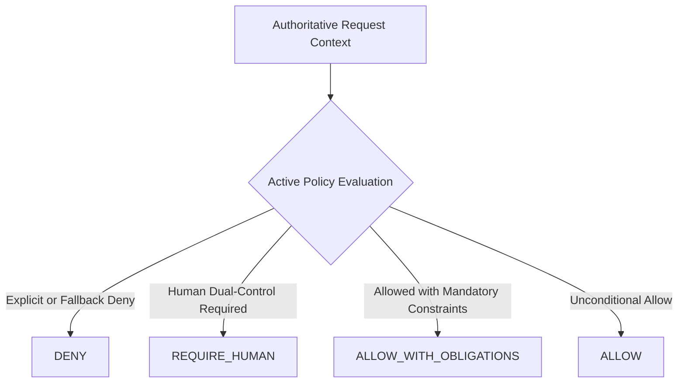

# SentinelFlow Deterministic Policy Engine (SGACA Phase P03 / P03.5)

## 1. Executive Summary & Core Architectural Invariant

The **SentinelFlow Deterministic Policy Decision Engine** provides the mathematical and algorithmic policy plane for the SentinelFlow Governed Agentic Control Architecture (SGACA). It enforces the fundamental architectural law of Fortified Enterprise Fleet autonomy:

$$\mathbf{AgentRecommendation \neq Permission}$$
$$\mathbf{Permission = DeterministicPolicyEngine(PolicyBundle, AuthoritativeContext, Action, EvalTime)}$$

The engine is **100% independent of Large Language Models (LLMs), Gemini, and Agent Development Kit (ADK) reasoning**. An AI agent or fleet coordinator can only propose actions; permission to execute actions is granted strictly and deterministically by the Go policy evaluator before any database, tool, secret, or egress boundary is crossed.

Even if `SENTINEL_AGENT_FLEET_ENABLED=false` or if the AI tier experiences complete failure or compromise, the deterministic policy engine continues to enforce immutable safety constraints.

---

## 2. Policy Decision Vocabulary

The policy engine evaluates requests into **strictly four top-level outcomes**:



1. **`DENY`**:
   The requested action is strictly prohibited. The response includes machine-readable reason codes (e.g. `IMMUTABLE_ORIGINALS_ENFORCED`, `CROSS_TENANT_FORBIDDEN`) and accumulated prohibitions. Not executable.
2. **`REQUIRE_HUMAN`**:
   The action cannot proceed autonomously and requires human review or dual-control release approval. Not executable.
3. **`ALLOW_WITH_OBLIGATIONS`**:
   The action is conditionally permitted only if the execution runtime satisfies all accumulated machine-readable obligations (e.g. `CANDIDATE_ONLY`, `IMMUTABLE_PARENT_REQUIRED`, `DETERMINISTIC_REVALIDATION`, `MAX_ATTEMPTS`). Executable only after proof of obligation satisfaction.
4. **`ALLOW`**:
   The action is permitted without additional obligations. Executable.

---

## 3. Executable Decision Semantics & TOCTOU-Safe Approval

SentinelFlow provides the explicit deterministic helper contract:
- `IsExecutableDecision(decision *PolicyDecision) bool`:
  - `ALLOW` $\rightarrow$ `true`
  - `ALLOW_WITH_OBLIGATIONS` $\rightarrow$ `false` (until `CanExecuteWithSatisfiedObligations` confirms 100% satisfaction)
  - `REQUIRE_HUMAN` $\rightarrow$ `false`
  - `DENY` $\rightarrow$ `false`

### TOCTOU-Safe Human Approval Flow
A `REQUIRE_HUMAN` decision must **never execute later merely because a human clicked a button in a UI**.
To prevent Time-Of-Check to Time-Of-Use (TOCTOU) exploits:
1. The human approval is committed as an immutable authoritative state record in the dual-control review queue with reviewer identity, timestamp, and identity-bound dual-control approval with cryptographic artifact and policy integrity binding.
2. When execution is subsequently attempted, the gateway **re-evaluates the exact action** through the Deterministic Policy Engine with:
   - Current resource version and SHA-256 digest;
   - Current active policy bundle;
   - Verified human approval record included in `authoritative_attributes`.
3. If the resource was mutated or a higher-layer policy was revoked in the interim, the re-evaluation deterministically denies execution.

---

## 4. Policy Domains & Layers

### 4.1 Policy Domains
Policies are partitioned into six functional domains:
- **`AGENT`**: Governs agent lifecycle, invocation quotas, autonomy ceilings, and cross-tenant boundaries.
- **`ARTIFACT`**: Governs raw input immutability, artifact hashing, and storage isolation.
- **`REMEDIATION`**: Governs candidate file generation, diff creation, and fix boundaries.
- **`TOOL`**: Governs least-privilege tool execution and connector access.
- **`RELEASE`**: Governs ACH transmission, release queues, and dual-control sign-offs.
- **`ENTERPRISE_ACTION`**: Governs destructive actions, configuration shifts, and high-autonomy operations.

### 4.2 Policy Hierarchy & Layer Precedence
Policies are evaluated in a strict 5-layer hierarchy. A lower numerical layer rank possesses higher authority:

| Layer Rank | Policy Layer | Scope / Description | Precedence Weight |
|---|---|---|---|
| **Layer 1** | `NETWORK_EXTERNAL` | Network-level ingress/egress boundaries & egress firewalls | 10 |
| **Layer 2** | `SENTINEL_SAFETY` | Immutable system invariants & non-negotiable safety laws | 20 |
| **Layer 3** | `ENTERPRISE` | Organization-wide compliance, dual-control, and audit rules | 30 |
| **Layer 4** | `TENANT` | Tenant-specific business constraints and custom workflows | 40 |
| **Layer 5** | `PARTNER` | Specific counterparty SLAs, formatting nuances, and delivery thresholds | 50 |

### 4.3 Intra-Layer Priority Semantics
Within any policy layer, the integer `Priority` field acts strictly as **deterministic ordering metadata**. It does **NOT** introduce first-match short-circuit semantics that could bypass applicable denials or prohibitions. Deny-dominance, obligation accumulation, and prohibition accumulation are preserved across all priority tiers.

---

## 5. Typed Obligations & Prohibitions for P04 Tool Gateway

### 5.1 Machine-Readable Typed Obligations
Obligations are strongly typed structs with canonical parameter mappings:
```json
{
  "type": "MAX_ATTEMPTS",
  "parameters": {
    "count": 3
  }
}
```

Supported Obligation Types:
- `DETERMINISTIC_REVALIDATION`: Must pass deterministic parser/validator before promotion.
- `DUAL_CONTROL`: Requires two distinct human approvals.
- `CANDIDATE_ONLY`: Can only emit unreleased candidate artifacts.
- `IMMUTABLE_PARENT_REQUIRED`: Must reference quarantined parent artifact ID and SHA-256.
- `MAX_ATTEMPTS`: Bounded retry ceiling (e.g. `count: 3`).
- `HUMAN_REVIEW`: Requires operator review before proceeding.
- `EXACT_ARTIFACT_HASH`: Enforces byte-exact match against evaluated digest.
- `AUDIT_REQUIRED`: Generates immutable audit evidence event.
- `SANDBOX_ONLY`: Execution restricted to ephemeral isolated environment.

### 5.2 Typed Prohibitions & Tool Capability Mapping
Prohibitions map directly to Tool Capabilities evaluated by Tool Gateway (P04) via `IsCapabilityProhibited(capability, prohibitions)`:

| Tool Capability (P04) | Prohibited By (ProhibitionType) | Blocked Action / Behavior |
|---|---|---|
| `direct_artifact_edit` | `MUTATE_ORIGINAL` | Modifying quarantined original file |
| `release_file` | `RELEASE`, `IRREVERSIBLE_FINANCIAL_AUTHORITY` | Autonomous file release or payment dispatch |
| `approve_release` | `APPROVE`, `IRREVERSIBLE_FINANCIAL_AUTHORITY` | Autonomous dual-control sign-off |
| `execute_sql` | `EXECUTE_SQL` | Direct arbitrary SQL execution |
| `access_secret` | `ACCESS_SECRET` | Raw secret or key retrieval |
| `cross_tenant_access` | `CROSS_TENANT_ACCESS` | Accessing foreign tenant resources |

---

## 6. Seeded SentinelFlow Safety Policies & Bootstrap Validator

The system is pre-seeded with 6 immutable foundational safety rules. At boot time, `ValidateSafetyBootstrap` verifies the existence and hash integrity of all 6 rules. If any rule is missing or tampered, the engine **fails closed**:

```
+----------------+---------------------+-------------------+---------------------------------------------+
| Policy ID      | Domain              | Layer             | Effect & Enforced Invariant                 |
+----------------+---------------------+-------------------+---------------------------------------------+
| SF-SAFE-001    | ARTIFACT            | SENTINEL_SAFETY   | DENY: MODIFY_ORIGINAL_ARTIFACT              |
|                |                     |                   | (Original quarantined files are immutable)  |
+----------------+---------------------+-------------------+---------------------------------------------+
| SF-SAFE-002    | RELEASE             | SENTINEL_SAFETY   | DENY: RELEASE_ARTIFACT                      |
|                |                     |                   | (AI agents cannot release financial files)  |
+----------------+---------------------+-------------------+---------------------------------------------+
| SF-SAFE-003    | RELEASE             | SENTINEL_SAFETY   | DENY: APPROVE_RELEASE                       |
|                |                     |                   | (Dual-control approvals require real humans)|
+----------------+---------------------+-------------------+---------------------------------------------+
| SF-SAFE-004    | REMEDIATION         | SENTINEL_SAFETY   | ALLOW_WITH_OBLIGATIONS: CREATE_CANDIDATE    |
|                |                     |                   | (Candidate-only, immutable parent, sandbox, |
|                |                     |                   |  deterministic revalidation, max attempts 3)|
+----------------+---------------------+-------------------+---------------------------------------------+
| SF-SAFE-005    | ENTERPRISE_ACTION   | SENTINEL_SAFETY   | DENY: Irreversible Autonomy (Level A5)     |
|                |                     |                   | (Agents cannot perform unconstrained acts)  |
+----------------+---------------------+-------------------+---------------------------------------------+
| SF-SAFE-006    | AGENT               | SENTINEL_SAFETY   | DENY: Cross-Tenant Queries                  |
|                |                     |                   | (Strict tenant separation at policy layer)  |
+----------------+---------------------+-------------------+---------------------------------------------+
```

---

## 7. RFC 8785 JSON Canonicalization Scheme (JCS) Hashing & Numeric Rules

All hashes use SHA-256 over **RFC 8785 JSON Canonicalization Scheme (JCS)** bytes, ensuring byte-identical verification across Go (Gateway) and Python (AI Tier) independent of key ordering, delimiters (`\n`, `:`, `=`), or Unicode characters (`€`, `漢字`, `🔒`).

1. **`policy_content_hash`**: $\text{SHA256}(\text{CanonicalJSON}(\text{policy\_payload}))$
2. **`policy_bundle_hash`**: $\text{SHA256}(\text{CanonicalJSON}(\text{bundle\_manifest}))$
3. **`evaluated_context_hash`**: $\text{SHA256}(\text{CanonicalJSON}(\text{context\_payload}))$
4. **`decision_hash`**: $\text{SHA256}(\text{CanonicalJSON}(\text{decision\_payload}))$

### 7.1 Strict JCS & I-JSON (RFC 7493) Constraints Enforced:
- **UTF-16 Code-Unit Property Sorting**: Object properties are sorted strictly by raw UTF-16 code units (RFC 8785 §3.2.3). Non-BMP astral plane characters (e.g. `\ud83d\ude00` -> `0xD83D, 0xDE00`) deterministically sort before high BMP characters (`\uffff` -> `0xFFFF`).
- **Duplicate Key Rejection**: Raw JSON inputs containing duplicate keys within any object are strictly rejected (`ErrDuplicateObjectKey`).
- **Non-Finite Numeric Rejection**: `NaN`, `+Infinity`, and `-Infinity` are rejected with `ErrNonFiniteNumber`.
- **Lone Surrogate Rejection**: Unpaired surrogates (`0xD800`..`0xDFFF`) and invalid UTF-8 byte sequences are rejected with `ErrLoneSurrogate` / `ErrInvalidUTF8`.
- **No Unicode Normalization**: Unicode code points are preserved as provided without applying NFC/NFD transforms.

### 7.2 Numeric Policy-Contract Rules:
To avoid IEEE 754 64-bit floating point precision loss in financial contexts:
- Policy conditions, limits, thresholds, and obligation parameters representing currency or high-precision values **must not rely on JSON floating-point numbers**.
- Use **typed integer minor units** (e.g. cents: `$10.50` $\rightarrow$ `1050`, basis points: `150`) or canonical decimal strings (e.g. `"10.5000"`).

---

## 8. Exact Immutable Policy Bundle Replay

Every policy evaluation permanently binds to:
- `policy_bundle_id`
- `policy_bundle_version`
- `policy_bundle_hash`
- `manifest`: Array of exact `(policy_id, version, content_hash)` entries evaluated.

### Historical Replay Protocol (`ReplayEvaluation`)
Replaying a historical decision does **not** query dynamic timestamp effectiveness. Instead, it compiles the **exact immutable bundle manifest** bound to the historical decision. Later-created backdated policies cannot alter historical replay.

---

## 9. Atomic Bundle Activation & Universal Outbox Journaling

1. **Atomic Compiled Bundle Swapping**: The engine pre-compiles and validates an immutable `CompiledBundle` before swapping it into `activeBundle` via lockless `atomic.Pointer`. Concurrent evaluations in flight each bind to exactly one complete bundle ID and hash.
2. **Universal Transactional Outbox Event (`POLICY_DECISION_RECORDED`)**:
   - `RecordDecisionTx` atomically writes the `PolicyDecision` into `agent_policy_decisions` and emits a universal domain event into `outbox_events` within the same database transaction.
   - **Decoupled from AgentWorkflow**: Supports policy evaluations for all subjects—autonomous agents, human operators, API callers, Tool Gateway checks, release gates, and future analytics.
   - **Payload Content**: Contains strictly identifiers and digests (`tenant_id`, `decision_id`, `request_id`, `policy_bundle_id`, `policy_bundle_version`, `policy_bundle_hash`, `decision_hash`, `decision`, `action`, `evaluated_context_hash`, `evaluated_at`, optional `workflow_id`). Raw financial data is strictly forbidden.
   - **Fault-Injection & Idempotency**: Rolled-back transactions leave zero trace in `agent_policy_decisions` or `outbox_events`. Re-recording the same decision is idempotent via `dedupe_key = policy-dec-<decision_id>`.

---

## 10. Measured Performance Benchmarks

- **Single-Threaded Throughput**: **16.8 µs / op** (~59,500 evaluations/sec per core)
- **Parallel Throughput (8 cores)**: **10.1 µs / op** (~98,000 evaluations/sec)
- **Fuzzing Robustness**: **38,176 executions (7,468 execs/sec)** across 8 workers with 0 invariant failures
- **Race Detection**: `go test -race ./internal/policy/...` $\rightarrow$ 0 data races
- **Network Latency**: **0.00 ms** (pure Go deterministic in-memory execution)
