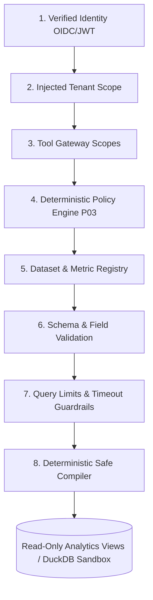

# SentinelFlow Lens: Governed Analytics & Investigation Workbench

## 1. Executive Summary & Status

> **Subsystem Status**: `PLANNED`  
> **Target Tier**: Fortified Enterprise Fleet Extension  
> **Security Level**: Zero-Trust, Read-Only, Advisory (Autonomy Level A1)  
> **Scope**: Documentation & Architectural Blueprint (No Runtime Code or Migrations in Phase P03)

**SentinelFlow Lens** is the planned **Governed Analytics Plane** for SentinelFlow. It equips human risk analysts, compliance officers, and autonomous specialist agents with an interactive, branching investigation environment to analyze financial file anomalies, ACH return trends, partner delivery reliability, and SLA breaches without compromising system security.

```
┌─────────────────────────────────────────────────────────────────────────────┐
│                       SENTINELFLOW LENS CONTROL PLANE                       │
├─────────────────────────────────────────────────────────────────────────────┤
│                                                                             │
│  ┌───────────────────────────────────────────────────────────────────────┐  │
│  │                    Lens React Investigation Workspace                 │  │
│  │  (Data Thread DAG • Visual Channel Shelves • Interactive Lineage)     │  │
│  └───────────────────────────────────┬───────────────────────────────────┘  │
│                                      │ Natural Language Question / Request  │
│                                      ▼                                      │
│  ┌───────────────────────────────────────────────────────────────────────┐  │
│  │                     Model Armor Input Screening                       │  │
│  └───────────────────────────────────┬───────────────────────────────────┘  │
│                                      │ Clean User Intent                    │
│                                      ▼                                      │
│  ┌───────────────────────────────────────────────────────────────────────┐  │
│  │                   AnalyticsAgent (Autonomy Level A1)                  │  │
│  │    • Zero Direct DB Credentials    • Emits Structured QueryIntent AST │  │
│  └───────────────────────────────────┬───────────────────────────────────┘  │
│                                      │ Structured QueryIntent               │
│                                      ▼                                      │
│  ┌───────────────────────────────────────────────────────────────────────┐  │
│  │                       Sentinel Analytics Gateway                      │  │
│  │                                                                       │  │
│  │  1. Tenant Scope Injection (X-Sentinel-Tenant)                        │  │
│  │  2. Deterministic Policy Engine (SF-SAFE & Enterprise Layer Checks)   │  │
│  │  3. Dataset & Semantic Metric Registry Validation                     │  │
│  │  4. Deterministic Safe Query Compiler (Parameterized SQL)             │  │
│  │  5. Hard Execution Limits (Max Rows: 10,000, Timeout: 5.0s)           │  │
│  └───────────────────────────────────┬───────────────────────────────────┘  │
│                                      │ Parameterized Safe Query             │
│                                      ▼                                      │
│  ┌───────────────────────────────────────────────────────────────────────┐  │
│  │                    CURATED READ-ONLY ANALYTICS DATA                   │  │
│  │                                                                       │  │
│  │   • Curated Read-Only SQL Views (v_analytics_*)                       │  │
│  │   • Ephemeral In-Memory DuckDB Analytical Sandbox (Per Investigation) │  │
│  │   • Zero Direct Production OLTP Database Access                       │  │
│  └───────────────────────────────────────────────────────────────────────┘  │
└─────────────────────────────────────────────────────────────────────────────┘
```

---

## 2. Core Architectural Invariants

1. **Zero Database Credentials to Models**: The `AnalyticsAgent` and all AI models **never receive or hold database credentials, connection strings, or raw table schemas**.
2. **Intent Over SQL**: Natural language questions are translated by the agent exclusively into a strongly typed, declarative **`QueryIntent` AST (Abstract Syntax Tree)**, never raw SQL.
3. **Deterministic Safe Query Compilation**: Only SentinelFlow's deterministic backend compiler transforms `QueryIntent` into parameterized, read-only SQL queries.
4. **Curated Read-Only Views**: Analytics execution targets pre-defined, indexed, sanitized analytics views (`v_analytics_*`) or ephemeral in-memory DuckDB sandboxes—never primary transaction tables.
5. **Immutable Financial Truth**: Operational financial artifacts and ledger hash chains remain strictly immutable. Analytics runs out-of-band and cannot mutate system state.
6. **Advisory Autonomy Level A1**: Analytics recommendations, charts, and summaries are strictly advisory. Lens has zero authority to approve releases, unquarantine files, alter policies, or execute payment transfers.

---

## 3. The 8-Stage Governed Query Pipeline

Every analytical query evaluated by SentinelFlow Lens must pass through an 8-stage gate before execution:



1. **Verified Identity**: Requesting user or agent must present a valid, cryptographically verified OIDC JWT token.
2. **Injected Tenant Scope**: The tenant identifier is injected server-side from authenticated context (`X-Sentinel-Tenant`). The client/agent cannot override tenant scope.
3. **Tool Gateway**: Enforces that the acting entity possesses the `analytics:query` or `analytics:explore` tool scope.
4. **Deterministic Policy Engine (P03)**: Evaluates `DomainEnterpriseAction` and `DomainTool` rules across all 5 policy layers.
5. **Dataset & Metric Registry**: Resolves the target dataset and measures against pre-approved, cataloged definitions.
6. **Schema & Field Validation**: Confirms that requested dimensions, metrics, and filter operators exist and match allowed data types.
7. **Query Limits & Guardrails**: Enforces hard execution ceilings (e.g. maximum 10,000 returned rows, mandatory time-range filter, 5-second query timeout).
8. **Deterministic Safe Compiler**: Compiles the validated `QueryIntent` into an immutable parameterized SQL string targeting read-only analytics views.

---

## 4. Subsystems & Core Capabilities

### 4.1 Lens React Workspace
- **Investigation Graph (Data Thread)**: An interactive visual DAG showing the sequence of analytical transformations, filters, and branching hypotheses.
- **Visual Encoding Shelves**: Drag-and-drop interface for mapping dataset dimensions and metrics to visual channels (X, Y, Color, Size, Grouping).
- **Chart Recommendations**: Suggests optimal visualizations (e.g. multi-series time-series for return spikes, bar charts for partner comparison, scatter plots for batch volume anomalies).

### 4.2 Semantic Metric Registry & Dataset Registry
- Pre-defined curated metrics:
  - `total_files_received`, `total_volume_usd`, `quarantine_rate`
  - `ach_return_count`, `ach_return_rate_r01`, `ach_return_rate_r03`, `ach_return_rate_r10`
  - `sla_breach_count`, `mean_time_to_remediate_seconds`
- Pre-defined curated datasets:
  - `v_analytics_ach_returns`: Sanitized return records aggregated by partner, return code, and settlement date.
  - `v_analytics_sla_performance`: Expected-file delivery milestones and latency metrics.
  - `v_analytics_validation_findings`: Error code frequencies across batch runs.

### 4.3 Structured `QueryIntent` Contract
```json
{
  "schema_version": "1.0",
  "dataset_id": "ds_ach_returns",
  "time_range": {
    "start_time": "2026-08-01T00:00:00Z",
    "end_time": "2026-08-19T00:00:00Z"
  },
  "metrics": ["ach_return_count", "quarantine_rate"],
  "dimensions": ["partner_id", "return_reason_code"],
  "filters": [
    {
      "field": "partner_id",
      "operator": "IN",
      "values": ["PARTNER-ALPHA", "PARTNER-BETA"]
    }
  ],
  "group_by": ["partner_id", "return_reason_code"],
  "order_by": [
    {
      "field": "ach_return_count",
      "direction": "DESC"
    }
  ],
  "limit": 100
}
```

### 4.4 Ephemeral DuckDB Analytical Sandbox
For complex multi-step investigations, SentinelFlow Lens can instantiate an isolated, ephemeral in-memory **DuckDB** instance populated strictly with the filtered, anonymized results of approved queries. This allows sub-second exploratory filtering and aggregation on the client/gateway without stressing production databases.

---

## 5. Planned Persistence Architecture (Draft Schema)

The following database tables are designed for future implementation (Phase P14+) and are **not yet created**:

```sql
-- 1. Curated Datasets
CREATE TABLE analytics_datasets (
    id            TEXT PRIMARY KEY,
    tenant_id     TEXT NOT NULL,
    name          TEXT NOT NULL,
    view_name     TEXT NOT NULL,
    description   TEXT,
    is_active     BOOLEAN NOT NULL DEFAULT TRUE,
    created_at    TIMESTAMP NOT NULL DEFAULT CURRENT_TIMESTAMP
);

-- 2. Dataset Field Catalog
CREATE TABLE analytics_dataset_fields (
    id            TEXT PRIMARY KEY,
    dataset_id    TEXT NOT NULL REFERENCES analytics_datasets(id),
    field_name    TEXT NOT NULL,
    field_type    TEXT NOT NULL, -- DIMENSION, METRIC, TIMESTAMP
    data_type     TEXT NOT NULL, -- STRING, INTEGER, NUMERIC, TIMESTAMP
    is_filterable BOOLEAN NOT NULL DEFAULT TRUE,
    is_groupable  BOOLEAN NOT NULL DEFAULT TRUE
);

-- 3. Semantic Metrics
CREATE TABLE analytics_metrics (
    id            TEXT PRIMARY KEY,
    tenant_id     TEXT NOT NULL,
    dataset_id    TEXT NOT NULL REFERENCES analytics_datasets(id),
    name          TEXT NOT NULL,
    formula       TEXT NOT NULL, -- e.g. SUM(return_count) / SUM(entry_count)
    unit          TEXT NOT NULL DEFAULT 'COUNT',
    created_at    TIMESTAMP NOT NULL DEFAULT CURRENT_TIMESTAMP
);

-- 4. Investigation Sessions
CREATE TABLE analytics_investigations (
    id            TEXT PRIMARY KEY,
    tenant_id     TEXT NOT NULL,
    title         TEXT NOT NULL,
    incident_id   TEXT,
    created_by    TEXT NOT NULL,
    created_at    TIMESTAMP NOT NULL DEFAULT CURRENT_TIMESTAMP,
    updated_at    TIMESTAMP NOT NULL DEFAULT CURRENT_TIMESTAMP,
    status        TEXT NOT NULL DEFAULT 'ACTIVE'
);

-- 5. Investigation Graph Nodes (Data Thread DAG)
CREATE TABLE analytics_investigation_nodes (
    id                TEXT PRIMARY KEY,
    investigation_id  TEXT NOT NULL REFERENCES analytics_investigations(id),
    parent_node_id    TEXT REFERENCES analytics_investigation_nodes(id),
    node_type         TEXT NOT NULL, -- QUERY, FILTER, VISUALIZE, NOTE
    query_intent_json TEXT,
    query_hash        TEXT,
    result_digest     TEXT,
    narrative         TEXT,
    created_at        TIMESTAMP NOT NULL DEFAULT CURRENT_TIMESTAMP
);

-- 6. Cached Result Sets
CREATE TABLE analytics_results (
    id            TEXT PRIMARY KEY,
    node_id       TEXT NOT NULL REFERENCES analytics_investigation_nodes(id),
    row_count     INTEGER NOT NULL,
    result_json   TEXT NOT NULL,
    result_hash   TEXT NOT NULL,
    created_at    TIMESTAMP NOT NULL DEFAULT CURRENT_TIMESTAMP
);

-- 7. Visualizations
CREATE TABLE analytics_visualizations (
    id            TEXT PRIMARY KEY,
    node_id       TEXT NOT NULL REFERENCES analytics_investigation_nodes(id),
    chart_type    TEXT NOT NULL, -- BAR, LINE, SCATTER, HEATMAP
    spec_json     TEXT NOT NULL, -- Vega-Lite / Flint JSON spec
    created_at    TIMESTAMP NOT NULL DEFAULT CURRENT_TIMESTAMP
);

-- 8. Compliance & Incident Export Packages
CREATE TABLE analytics_exports (
    id                TEXT PRIMARY KEY,
    investigation_id  TEXT NOT NULL REFERENCES analytics_investigations(id),
    tenant_id         TEXT NOT NULL,
    export_type       TEXT NOT NULL, -- PDF_SUMMARY, CSV_BUNDLE, AUDIT_PACKAGE
    content_digest    TEXT NOT NULL,
    created_at        TIMESTAMP NOT NULL DEFAULT CURRENT_TIMESTAMP
);

-- 9. Analytical Audit Log
CREATE TABLE analytics_query_events (
    id            TEXT PRIMARY KEY,
    tenant_id     TEXT NOT NULL,
    actor_id      TEXT NOT NULL,
    node_id       TEXT REFERENCES analytics_investigation_nodes(id),
    query_hash    TEXT NOT NULL,
    latency_ms    INTEGER NOT NULL,
    rows_returned INTEGER NOT NULL,
    executed_at   TIMESTAMP NOT NULL DEFAULT CURRENT_TIMESTAMP
);
```

---

## 6. Integration with SGACA Subsystems

| Subsystem | Integration Touchpoint | Guardrail & Invariant Enforced |
|---|---|---|
| **P03 Policy Engine** | Query Pre-Flight Gate | Checks `DomainEnterpriseAction` / `DomainTool` before safe compiler execution. |
| **P04 Tool Gateway** | Tool Dispatch Layer | Exposes `lookup_metric`, `compile_query_intent`, and `execute_safe_analytics`. |
| **P05/P06 ADK Fleet** | Specialist Fleet Coordination | `TriageAgent` and `EscalationAgent` request Lens data threads for deep anomaly diagnosis. |
| **P09 Model Armor** | Boundary Screening | Screen natural-language queries for prompt injections; screen chart narratives for PII. |
| **P10 Memory Promotion** | Knowledge Graph Feeding | High-confidence investigation findings can be promoted to `agent_memory` with human sign-off. |
| **P12 Return Risk Agent**| Return Anomaly Detection | Provides deep longitudinal ACH return rates (R01-R85) to predict counterparty risk. |
| **Evidence Ledger** | Cryptographic Audit Link | Completed investigation reports hash their DAG into the append-only SHA-256 ledger. |
| **ReviewQueue** | Dual-Control Approvals | Attach investigation charts directly to file release approval packages for reviewers. |

---

## 7. Hackathon Scope & Lens MVP

- **Current Repository Phase**: Phase P03 completed. SentinelFlow Lens is strictly **`PLANNED`**.
- **Execution Policy**: No Lens runtime code, database migrations, or dependencies may be deployed until the core Fortified Enterprise Fleet control plane (P03–P12) is fully stabilized and verified.
- **Future MVP User Journey (Post-Core)**:
  1. User asks: *"Why did Partner Alpha's ACH return rate spike on Tuesday?"*
  2. `AnalyticsAgent` generates `QueryIntent` targeting `v_analytics_ach_returns` with filters for `partner_id=PARTNER-ALPHA` and return code breakdown.
  3. Policy Engine verifies request $\rightarrow$ Safe Compiler emits parameterized query.
  4. Curated view returns 12 aggregated rows.
  5. Lens renders a Vega-Lite multi-series chart and records Node 1 in the Investigation Graph.
