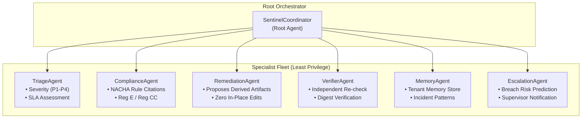

# SentinelFlow Governed Agentic Architecture (SGACA)
## Technical Architecture Specification — Google All Things Agentic Hackathon

> **Target Track**: Fortified Enterprise Fleet  
> **Platform**: Gemini Models, Google Agent Development Kit (ADK), Model Armor Screening  
> **Repository**: `YashwanthGathuku/didactic-octo-funicular`  
> **Status**: Specification & Architectural Baseline  

---

## 1. Executive Summary & Core Mission

**SentinelFlow** is a high-assurance financial file reliability and pre-ledger ingress platform. It processes, validates, and routes mission-critical batch payment files (NACHA ACH, Fedwire, ISO 20022) with zero-tolerance for silent corruption, unauthorized mutations, or uncalibrated autonomous execution.

The **SentinelFlow Governed Agentic Architecture (SGACA)** introduces a governed multi-agent control plane on top of this established deterministic core. Instead of exposing fragile chat loops or granting models direct execution privileges, SGACA deploys an **orchestrated fleet of specialist agents** running asynchronously in the background.

```
       ┌────────────────────────────────────────────────────────────┐
       │                HUMAN OPERATIONS & SUPERVISORS              │
       └─────────────────────────────┬──────────────────────────────┘
                                     │ Dual-Control Approval (N-of-M)
                                     ▼
┌─────────────────────────────────────────────────────────────────────────────┐
│                    GOVERNED AGENTIC CONTROL PLANE (SGACA)                  │
│                                                                             │
│     ┌─────────────────────────────────────────────────────────────────┐     │
│     │               Model Armor Screening (Input / Output)            │     │
│     └──────────────────────────────┬──────────────────────────────────┘     │
│                                    ▼                                        │
│     ┌─────────────────────────────────────────────────────────────────┐     │
│     │               SentinelCoordinator (Root Agent)                  │     │
│     └──────┬────────────┬───────────┬───────────┬───────────┬─────────┘     │
│            │            │           │           │           │               │
│            ▼            ▼           ▼           ▼           ▼               │
│       ┌─────────┐  ┌──────────┐ ┌──────────┐┌──────────┐┌──────────┐        │
│       │ Triage  │  │Compliance│ │Remediate ││ Verifier ││ Memory   │        │
│       │ Agent   │  │  Agent   │ │  Agent   ││  Agent   ││  Agent   │        │
│       └─────────┘  └──────────┘ └──────────┘└──────────┘└──────────┘        │
│            ▲                                                ▲               │
│            └──────────────── Escalate Agent ────────────────┘               │
└────────────────────────────────────┬────────────────────────────────────────┘
                                     │ Typed Proposals (Advisory Only)
                                     ▼
┌─────────────────────────────────────────────────────────────────────────────┐
│                 DETERMINISTIC FINANCIAL ENGINE (AUTHORITATIVE)              │
│                                                                             │
│   • Streaming Zero-Copy Parser   • Versioned Release Policies (N-of-M)      │
│   • Strict Mod-10 Checksums      • Append-Only Linear Hash Chain Ledger     │
│   • Batch Hash Sum Accumulators  • Asymmetric Ledger Checkpoint Schema      │
│   • Fail-Closed Quarantine       • Tenant-Scoped Database Isolation         │
│                                    (SQLite App Scope / PostgreSQL RLS)      │
└─────────────────────────────────────────────────────────────────────────────┘
```

---

## 2. Fundamental Mathematical Invariants

### 2.1 Autonomous Execution Equation
Autonomous action within SentinelFlow is strictly defined as the intersection of reasoning, policy, capability, and deterministic verification:

$$\text{AUTONOMY} = \text{AgentReasoning} \cap \text{PolicyPermission} \cap \text{ToolCapability} \cap \text{DeterministicVerification}$$

If any single component in this intersection is null or evaluates to false, autonomy is bounded to zero (refusal/no-op).

### 2.2 Irreversible Financial Execution Invariant
For any mutation of ledger state, release of quarantined funds, or generation of downstream payment transmissions:

$$\text{Execute} = \text{Verified} \land \text{PolicyAllowed} \land \text{IdentityValid} \land \text{HumanAuthorized} \land \text{ArtifactHashMatched}$$

Where:
- $\text{Verified}$: Deterministic validation rules report zero blocking findings against the exact artifact bytes.
- $\text{PolicyAllowed}$: The versioned contract policy in force on the transaction business date permits the operation.
- $\text{IdentityValid}$: Principal authentication verified against cryptographic OIDC tokens (never self-asserted).
- $\text{HumanAuthorized}$: Dual-control separation of duties satisfies $N \ge 2$ distinct authorized human reviewers ($A_1 \neq A_2 \land A_i \neq \text{Proposer}$).
- $\text{ArtifactHashMatched}$: The SHA-256 digest of the artifact in storage matches the cryptographic integrity digest on the policy decision.

**If any term is false, execution is denied.**

---

## 3. The 12 Non-Negotiable Architectural Laws

1. **Deterministic Software Establishes Financial Truth**: No AI output may overrule a deterministic checksum, Mod-10 check digit, batch hash sum, or parser error.
2. **Original Artifacts are Immutable**: Quarantined files are never mutated, patched in-place, or overwritten. Corrections exist solely as new **derived artifacts** referencing the parent.
3. **Agents Have Bounded Explicit Capabilities**: Every agent operates strictly within a declared, static tool capability matrix.
4. **Agents Use Typed Tools Only**: Free-form SQL queries, arbitrary shell execution, unconstrained filesystem access, and untyped network requests are banned by construction.
5. **Policy Determines Allowed Actions Pre-Reasoning**: Policy boundaries are evaluated before prompt construction and model inference.
6. **Tenant Identity Comes from Infrastructure**: Tenancy is established from cryptographic claims in the verified JWT context (`X-Sentinel-Tenant`), never from agent inference or user prompt text.
7. **Zero Direct Secret Access**: Agents never hold database credentials, API secrets, KMS private keys, or signing tokens.
8. **Independent Verification (Maker-Checker Invariant)**: The `RemediationAgent` that drafts a fix cannot verify or approve its own proposal. A separate `VerifierAgent` (Critic) and the Go Verification Service execute 12 deterministic checks under **Deterministic Dominance** ($\text{CriticOpinion} \neq \text{VerificationAuthority}$). See [`docs/architecture/INDEPENDENT_VERIFICATION.md`](file:///c:/Users/Gathu/Projects/fintech/docs/architecture/INDEPENDENT_VERIFICATION.md).
9. **Memory is Advisory, Never Authoritative**: Cross-session Memory Bank contents provide pattern context only; they can never waive a validation rule or grant an approval.
10. **Zero Retention of Private Chain-of-Thought**: Model scratchpads and ungrounded intermediate thoughts are discarded; only structured `AgentStep` execution records are retained.
11. **Zero Autonomous Release Authority**: Agents have no ability to execute file release, bank transmission, or funds settlement.
12. **Full Provenance & Version Auditing**: Every agent recommendation must capture exact provider, model name, model version, prompt template version, tool schema versions, policy versions, and input evidence digests.

---

## 4. Preservation of Authoritative Systems

The existing deterministic core remains 100% authoritative. The agent platform is strictly additive:

| Subsystem | Existing Implementation | Authoritative Role | Agent Fleet Boundary |
|---|---|---|---|
| **NACHA Ingress Parser** | `gateway/internal/nacha/` | Computes Mod-10, batch hash sums, fixed 94-byte widths | Agents receive redacted finding codes only |
| **Artifact Store** | `gateway/internal/objectstore/` | Immutable SHA-256 blob storage (S3/MinIO/Filesystem) | Agents cannot mutate or overwrite stored objects |
| **Quarantine Engine** | `gateway/worker.go` | Fail-closed state transitions to `QUARANTINED` | Agents analyze quarantined files; cannot unquarantine |
| **Durable Job Worker** | `gateway/internal/jobs/` | PostgreSQL/SQLite lease pool with transactional outbox | Agents run out-of-band via asynchronous queues |
| **Audit Ledger** | `gateway/internal/ledger/` | Append-only SHA-256 linear hash chain | Agent executions append audit events; cannot edit ledger |
| **Review & Dual Control** | `gateway/internal/review/` | Enforces 2-person rule and freshness integrity digests | Agent proposals populate review queue for human sign-off |
| **Tenant Isolation** | `gateway/internal/repository/` | SQLite app scope / PostgreSQL RLS policies | Agents operate strictly within request's tenant context |

---

## 5. Specialist Agent Fleet

The agent fleet is implemented in Python 3.11 with specialist agent definitions:



### Specialist Agent Tool Capability Matrix

| Agent Name | Declared Agent Name | Permitted Tools | Prohibited Tools |
|---|---|---|---|
| **Coordinator** | `SentinelCoordinator` | `route_to_specialist`, `synthesize_response` | Mutating tools, direct SQL |
| **Triage** | `TriageAgent` | `lookup_finding`, `check_sla_status` | `propose_derived_artifact`, release tools |
| **Compliance** | `ComplianceAgent` | `lookup_finding`, `lookup_nacha_rule` | File mutation, release tools |
| **Remediation** | `RemediationAgent` | `lookup_finding`, `propose_derived_artifact` | `release_file`, `approve_incident`, direct edits |
| **Verifier** | `VerifierAgent` | `lookup_finding`, `verify_digest` | Remediation tools, state mutation |
| **Memory** | `MemoryAgent` | `recall_partner_history`, `store_memory` | Cross-tenant memory access |
| **Escalation** | `EscalationAgent` | `check_sla_status`, `recall_partner_history` | Autonomous waiver grant |

---

## 6. Google Cloud Platform & Gemini Architecture

- **Gemini 2.5 Flash (`google-genai`)**: Grounded reasoning utilizing structured JSON output mode with calibrated temperature ($T=0.1$) for deterministic output schemas (`TESTED`).
- **Model Armor Screening**: Dual-stage screening engine:
  - **Input Screening**: Intercepts prompt injection payloads, instruction overrides, and raw unredacted PII (`IMPLEMENTED`).
  - **Output Screening**: Flags PII exfiltration and unauthorized action verbs (`IMPLEMENTED`).
  - **Managed Cloud Model Armor API**: Integration is `PLANNED` for P06.
- **Google Cloud KMS Checkpoints**: `ledger_checkpoints` table with ECDSA P-256 asymmetric signature storage (`IMPLEMENTED`). Managed Cloud KMS API is `PLANNED`.
- **PostgreSQL 16 Multi-Tenant RLS**: System of record with Row-Level Security (`TESTED`). Cloud SQL deployment script in `deploy/setup-gcp.sh` (`PLANNED`).
- **Google Cloud Run**: Containerized service configs in `deploy/` (`IMPLEMENTED`).
- **Secret Hygiene**: Scrubber and sealed credential types preventing credential disclosure (`TESTED`).

---

## 7. Feature Flagging & Execution Modes

To ensure zero risk to existing operations, the agent fleet is governed by a strict feature flag and shadow execution model:

```go
// gateway/config.go
type Config struct {
    AgentFleetEnabled bool   // Read from SENTINEL_AGENT_FLEET_ENABLED (default: false)
    AgentFleetMode    string // SHADOW (default) | ADVISORY | ACTIVE
}
```

- When `AGENT_FLEET_ENABLED=false`: Gateway operates entirely in deterministic mode; zero agent calls are dispatched.
- When `AGENT_FLEET_MODE=SHADOW`: Agent fleet executes asynchronously on validation failure, logs predictions and telemetry to `agent_runs`, but produces zero operator-visible state mutations.
- When `AGENT_FLEET_MODE=ADVISORY`: Agent recommendations populate operator consoles for human review.
- When `AGENT_FLEET_MODE=ACTIVE`: Agent remediation proposals may enter the verification and dual-control queue.

---

## 8. Deterministic Policy Decision Engine (Phase P03 / P03.5)

The Deterministic Policy Engine establishes the mathematical policy boundary between AI proposals and system execution:

$$\text{AgentRecommendation} \neq \text{Permission}$$
$$\text{Permission} = \text{DeterministicPolicyEngine}(\text{PolicyBundle}, \text{Context}, \text{Action}, \text{Time})$$

- **Vocabulary**: Exactly 4 top-level decisions: `ALLOW`, `DENY`, `ALLOW_WITH_OBLIGATIONS`, `REQUIRE_HUMAN`.
- **Precedence Hierarchy**: 5 layers: `NETWORK_EXTERNAL` (10) > `SENTINEL_SAFETY` (20) > `ENTERPRISE` (30) > `TENANT` (40) > `PARTNER` (50).
- **Invariants & Composition**:
  - Deny dominates allow across all layers.
  - Lower layers cannot relax higher layer prohibitions.
  - Obligations and prohibitions accumulate across all matching rules.
  - Fail-closed: unsupported action or missing active policy evaluates to `DENY`.
  - Priority acts strictly as deterministic intra-layer ordering metadata, never bypassing denials.
- **Typed Machine-Readable Constraints**: Machine-readable typed obligations (`MAX_ATTEMPTS`, `CANDIDATE_ONLY`, etc.) and prohibitions mapped directly to Tool Gateway capabilities via `IsCapabilityProhibited`.
- **Executable Decision Semantics**: Explicit contract `IsExecutableDecision` (only `ALLOW` is immediately executable; `ALLOW_WITH_OBLIGATIONS` requires verified satisfaction; `REQUIRE_HUMAN` requires re-evaluation upon verified human record to eliminate TOCTOU).
- **RFC 8785 Canonical Hashing**: JSON Canonicalization Scheme (JCS) producing identical digests across Go and Python for `policy_content_hash`, `policy_bundle_hash`, `evaluated_context_hash`, and `decision_hash`.
- **Exact Historical Replay**: Evaluations permanently bind to `(bundle_id, version, bundle_hash, manifest)`. Replay compiles exact manifests rather than relying on mutable timestamp querying.
- **Atomic Bundle Activation**: Lockless atomic swapping (`atomic.Pointer[CompiledBundle]`) with mandatory safety bootstrap verification (`ValidateSafetyBootstrap`).
- **Persistence & Outbox Journaling**: Migration `017_policy_engine.sql` stores versioned `policy_definitions`, `policy_bundle_versions`, and `agent_policy_decisions` with transactional crash-consistent event journaling (`RecordDecisionTx`).
- **Performance**: In-memory execution at ~10.1 µs (parallel) / 16.8 µs (single-threaded), verified with race detector and 38,176 fuzz iterations.

---

## 9. Governed Tool & Action Gateway (Phase P04)

The Governed Tool & Action Gateway is the exclusive enforcement boundary between callers/agents and system capabilities:

$$\text{EffectiveToolAccess} = \text{RegisteredTool} \cap \text{CallerCapability} \cap \text{ContextToolAllowlist} \cap \text{TenantAuthorization} \cap \text{PolicyPermission} \cap \text{ResourceScope} \cap \text{ObligationSatisfaction}$$

- **12-Step Conjunction Lifecycle**: Identity/tenant verification $\rightarrow$ versioned registry lookup $\rightarrow$ caller capability/context allowlist check $\rightarrow$ shadow mode check $\rightarrow$ input hashing & idempotency lock $\rightarrow$ TOCTOU resource preconditions $\rightarrow$ strict JSON/size validation $\rightarrow$ policy engine evaluation $\rightarrow$ capability prohibition check $\rightarrow$ pre-execution obligations $\rightarrow$ bounded isolated handler execution $\rightarrow$ output validation, redaction filter, post-obligations, and atomic outbox journaling.
- **Server-Injected Trusted Context**: `TrustedExecutionContext` carries verified `TenantID`, `CallerID`, `Roles`, and `AutonomyLevel`. Model-supplied arguments cannot override authority.
- **Side-Effect Blast Radius Hierarchy**: Explicit classes (`READ_ONLY`, `INTERNAL_STATE_WRITE`, `CANDIDATE_SANDBOX_WRITE`, `REVERSIBLE_EXTERNAL`, `IRREVERSIBLE_EXTERNAL`, `IRREVERSIBLE_FINANCIAL`). No agent tool may ever possess `IRREVERSIBLE_FINANCIAL`.
- **Singleflight Idempotency**: Durable tenant-scoped singleflight execution ensuring concurrent duplicate requests execute exactly once and identical requests replay cached results safely.
- **Initial Safe Registered Tools**: `incident.get`, `validation.findings.list_redacted`, `artifact.metadata.get`, `workflow.get`.
- **Universal Persistence & Outbox Journaling**: Migration `018_tool_gateway.sql` records `tool_invocations` and emits `TOOL_INVOCATION_SUCCEEDED`, `TOOL_INVOCATION_DENIED`, and `TOOL_INVOCATION_FAILED` to generic `outbox_events`.
- **Performance**: Registry lookup at 37.5 ns/op, idempotency lookup at 367.6 ns/op, and complete governed execution at 104 µs/op with 0 data races.
- **Full Architecture Specification**: See [`docs/architecture/TOOL_GATEWAY.md`](file:///c:/Users/Gathu/Projects/fintech/docs/architecture/TOOL_GATEWAY.md).

---

## 10. SentinelFlow Lens: Governed Analytics Plane (PLANNED)

The planned **SentinelFlow Lens** subsystem introduces a zero-trust, read-only analytics and investigation workbench for deep anomaly diagnosis and ACH return trend analysis without compromising production data isolation.

- **Status**: `PLANNED` (Documentation & Architecture Blueprint; see [`docs/architecture/SENTINELFLOW_LENS.md`](file:///c:/Users/Gathu/Projects/fintech/docs/architecture/SENTINELFLOW_LENS.md) and [`docs/third_party/DATA_FORMULATOR_REFERENCE.md`](file:///c:/Users/Gathu/Projects/fintech/docs/third_party/DATA_FORMULATOR_REFERENCE.md)).
- **Core Invariant**: The `AnalyticsAgent` operates at Autonomy Level A1 (Advisory Only) and never receives database credentials. Natural language is translated into a declarative `QueryIntent` AST, compiled by SentinelFlow's deterministic Safe Query Compiler, and executed strictly against curated read-only views or ephemeral in-memory DuckDB sandboxes.
- **8-Stage Governance Gate**: All analytics requests must pass through Identity $\rightarrow$ Tenant Scope $\rightarrow$ Tool Gateway $\rightarrow$ Policy Engine $\rightarrow$ Dataset Registry $\rightarrow$ Schema Validation $\rightarrow$ Query Limits $\rightarrow$ Safe Compiler.

---

## 11. Independent Verification & Critic Architecture (Phase P08)

Phase P08 establishes the **Maker-Checker Independent Verification Plane** governing all remediated candidate payment files before human operations sign-off:

$$\mathbf{CriticOpinion \neq VerificationAuthority \implies VerificationAuthority = GoControlPlane}$$
$$\mathbf{DeterministicVerification \succ CriticOpinion}$$
$$\mathbf{Verified \neq HumanApproved \neq Released}$$

- **12 Typed Deterministic Integrity Checks**: The Go Verification Service (`gateway/internal/verification/`) evaluates an immutable checklist covering parent immutability, candidate 94-byte NACHA structural alignment, derivation ledger hash integrity, policy freshness (TOCTOU), and resource version locks.
- **Physical Byte Re-Read & Dual-Run Validation**: Verification discards in-memory candidate buffers and re-reads raw bytes by SHA-256 address from ObjectStore, executing an independent second pass of the zero-copy NACHA streaming validator ($Run_1 \equiv Run_2$).
- **ADK VerifierAgent (Critic) Guardrails**: Autonomy Level A1 read-only critic reviewing structured evidence envelopes under 3-zone prompt trust partitioning and input minimization (zero raw PII or credentials).
- **Deterministic Dominance & Conflict Resolution**: Deterministic failures unconditionally reject or retry candidates regardless of critic approval (preventing LLM hallucinated passes); critic disputes on deterministically valid files escalate safely to human review.
- **Dual-Control Human Release**: Candidate verification produces state `VERIFIED`, but never autonomous transmission. Release requires $N \ge 2$ distinct human approvers with TOCTOU policy re-check and append-only linear hash chain ledger commitment.
- **Full Architecture Specification**: See [`docs/architecture/INDEPENDENT_VERIFICATION.md`](file:///c:/Users/Gathu/Projects/fintech/docs/architecture/INDEPENDENT_VERIFICATION.md).


